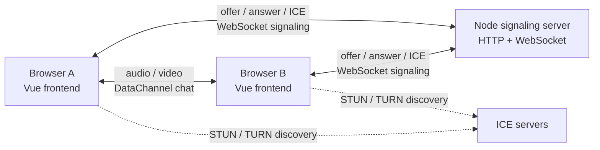

# WebRTC 1-on-1 Video Chat Demo

the basic WebRTC flow from scratch

## Features

- `getUserMedia` local camera and microphone
- `RTCPeerConnection` audio/video
- Offer, answer, and ICE candidate exchange
- DataChannel text chat
- Hang up cleanup for peer connections and media tracks
- Connection state, ICE state, signaling state, and WebRTC stats display
- Configurable STUN / TURN servers
- GitHub Pages frontend deployment

## Architecture



Signaling only coordinates connection setup. After WebRTC connects, audio, video, and DataChannel messages are sent between browsers through WebRTC. Depending on the network, traffic may be direct peer-to-peer or relayed through a TURN server.

## Project Structure

```text
server/signaling.ts                  Node HTTP + WebSocket signaling server
src/composables/useWebRTC.ts         WebRTC session facade
src/composables/webrtc/              Smaller WebRTC composables
src/pages/VideoChatPage.vue          Main page
src/components/                      UI components
.github/workflows/deploy-pages.yml   GitHub Pages workflow
```

## Setup

```sh
pnpm install
cp .env.example .env
```

The project expects Node.js `^20.19.0 || >=22.12.0`.

## Local Development

Start the signaling server:

```sh
pnpm dev:server
```

Start the Vue app:

```sh
pnpm dev
```

Open two browser tabs at:

```text
http://localhost:5173
```

Enter the same room id in both tabs.

## Environment Variables

Frontend environment variables use the `VITE_` prefix because they are read by Vite at build time.

Local `.env`:

```text
VITE_SIGNALING_URL=ws://localhost:3001
```

Production frontend builds should use a secure WebSocket URL:

```text
VITE_SIGNALING_URL=wss://your-signaling-service.example.com
```

Optional ICE server settings:

```text
VITE_STUN_URL=stun:stun.l.google.com:19302
VITE_TURN_URL=turn:your-turn.example.com:3478
VITE_TURN_USERNAME=your-turn-username
VITE_TURN_CREDENTIAL=your-turn-password
```

If the TURN variables are incomplete, the app ignores TURN and only uses STUN.

The signaling server reads:

```text
PORT=3001
```

Most cloud platforms set `PORT` automatically, so you usually do not need to configure it manually.

## STUN / TURN

Default behavior:

- Uses `stun:stun.l.google.com:19302` when `VITE_STUN_URL` is not set.
- Adds TURN only when `VITE_TURN_URL`, `VITE_TURN_USERNAME`, and `VITE_TURN_CREDENTIAL` are all present.
- TURN credentials belong in deployment environment variables, not committed source files.

## Signaling Server Deployment

Deploy `server/signaling.ts` to a host that supports long-running Node processes and WebSocket connections, for example Render or Railway.

Suggested service settings:

```text
Service type: Web Service
Runtime: Node
Build Command: pnpm install --frozen-lockfile
Start Command: pnpm start:server
Health Check Path: /health
```

The server exposes:

```text
GET /health -> ok
```

After deployment, copy the public WebSocket URL:

```text
wss://your-signaling-service.onrender.com
```

Use that value as `VITE_SIGNALING_URL` when building or deploying the frontend.

## GitHub Pages Deployment

The frontend deploys through:

```text
.github/workflows/deploy-pages.yml
```

Before deploying:

1. Deploy the signaling server first.
2. Enable GitHub Pages with source set to GitHub Actions.
3. Add an Actions repository variable:

```text
Settings > Secrets and variables > Actions > Variables > New repository variable
```

```text
Name: VITE_SIGNALING_URL
Value: wss://your-signaling-service.example.com
```

4. Push to `main` or run the workflow manually.

The workflow currently builds with:

```text
BASE_PATH=/webrtc-from-scratch/
```

If the repository name changes, update `BASE_PATH` in `.github/workflows/deploy-pages.yml`.

## WebRTC Flow

1. Both clients connect to the signaling server.
2. Both clients join the same room id.
3. When the second peer joins, the first peer creates an offer.
4. The offer is sent through the signaling server.
5. The second peer sets the remote offer and creates an answer.
6. The answer is sent back through the signaling server.
7. Both peers exchange ICE candidates through the signaling server.
8. WebRTC establishes the media path.
9. Text chat uses a WebRTC DataChannel.
10. Hang up closes peer connections, DataChannels, sockets, and media tracks.

## Verification

Run:

```sh
pnpm lint
pnpm test:unit --run
pnpm build
```

Manual checks:

- Two clients can join the same room.
- A third client receives `Room is full`.
- Joining without camera or microphone permission still works.
- `Start media` triggers browser permission and shows local video.
- Remote video appears after both peers enable media.
- DataChannel messages work in both directions.
- Connection state and stats update.
- Hang up stops camera and microphone.
